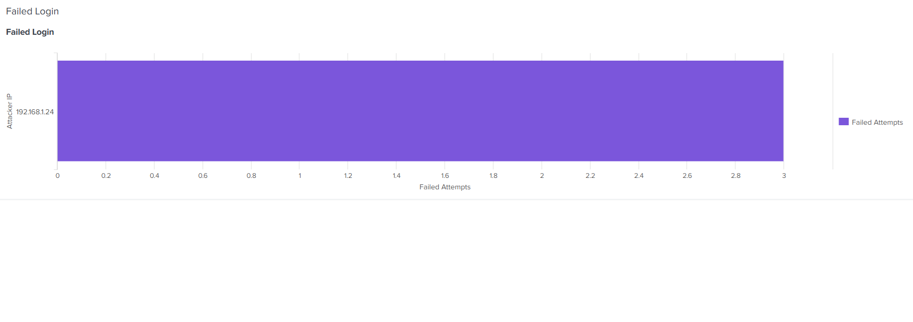
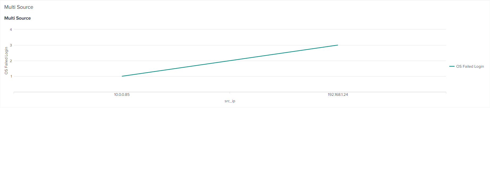

# Threat detection dashboard (Demo Version)

This project demonstrates log ingestion and analysis using **Splunk Free Demo**.

## Dashboard Panels

### 1. Failed Login Attempts


### 2. Firewall Blocks


### 3. Application Login Errors


### 4. Multi-Source Correlation



## 🔹 Dashboard Overview

The **Threat Detection Dashboard** visualizes log data from multiple sources:

### 1️⃣ Failed Login Attempts
- Detects repeated failed login attempts from operating system logs.
- Visualization: **Bar Chart**
- Example:


### 2️⃣ Firewall Blocks
- Displays blocked connection attempts and reasons (e.g., brute force, multiple failed logins).  
- Visualization: **Pie Chart**
- Example:


### 3️⃣ Application Errors
- Tracks authentication timeouts and multiple login attempts in applications.  
- Visualization: **Column Chart**
- Example:


### 4️⃣ Multi-Source Correlation
- Correlates events across OS, firewall, and application logs to highlight suspicious IP activity.  
- Visualization: **Line Chart / Table**
- Example:


---

## 🔹 SPL Queries

### Failed Logins
```spl
index=threat_demo sourcetype="operating system" "Failed password"
| rex field=_raw "from\s(?<src_ip>\d+\.\d+\.\d+\.\d+)"
| stats count by src_ip
| where count > 2
| rename src_ip as "Attacker IP", count as "Failed Attempts"
Firewall Blocks
spl
Copy code
index=threat_demo sourcetype="network and security" "BLOCK"
| rex field=_raw "(?<src_ip>\d+\.\d+\.\d+\.\d+):\d+\s->"
| stats count by src_ip, REASON
| rename src_ip as "Blocked IP", count as "Block Count"
Application Errors
spl
Copy code
index=threat_demo sourcetype="application" ("Authentication timeout" OR "Multiple login attempts")
| rex field=_raw "from\s(?<src_ip>\d+\.\d+\.\d+\.\d+)"
| stats count by src_ip
| rename src_ip as "Source IP", count as "App Error Count"
Multi-Source Correlation (Demo-Compatible)
spl
Copy code
index=threat_demo sourcetype="operating system" "Failed password"
| rex field=_raw "(?<src_ip>\d+\.\d+\.\d+\.\d+)"
| eval log_type="OS Failed Login"
| stats count by src_ip log_type
| append [
    search index=threat_demo sourcetype="network and security" "BLOCK"
    | rex field=_raw "(?<src_ip>\d+\.\d+\.\d+\.\d+):\d+\s->"
    | eval log_type="Firewall Block"
    | stats count by src_ip log_type
]
| append [
    search index=threat_demo sourcetype="application" ("Authentication timeout" OR "Multiple login attempts")
    | rex field=_raw "(?<src_ip>\d+\.\d+\.\d+\.\d+)"
    | eval log_type="App Error"
    | stats count by src_ip log_type
]
| chart sum(count) over src_ip by log_type
🔹 How to Run the Project
Open Splunk Free Demo → Search & Reporting.

Upload the logs from the logs/ folder.

Run each SPL query in the search bar.

Save visualizations as dashboard panels under Classic Dashboard.

Take screenshots and place them in the assets/ folder.

Update the README with screenshots and SPL queries.

🔹 Outcome
Multi-source threat detection is visualized clearly for potential attacks.

Dashboard demonstrates correlation between OS, firewall, and application logs.

All steps are reproducible in the Splunk Free Demo.

🔹 Optional Enhancements
Add a short video demo showing the live dashboard interaction.

Include additional logs for realistic traffic simulation.

Expand correlation to geo-location analysis for IPs.

🔹 Author
Parthiban Ganesan

GitHub: https://github.com/partz2510

Portfolio: Multiple Splunk and cybersecurity projects

yaml
Copy code

---

This README is:

- **Clear for employers** — shows what you built and how.  
- **Demo-compatible** — no advanced Splunk Enterprise features.  
- **Visual & descriptive** — includes screenshots, queries, and dashboard explanation.  

---

If you want, I can **also make a polished version of your `assets/` folder structure and README links** ready to push so your GitHub repo looks fully professional.  

Do you want me to do that next?


You said:
can you make it into one entire block of code


ChatGPT said:
Absolutely! Here’s the entire polished README.md as a single block, ready to copy-paste into your repo:

markdown
Copy code
# Cloud Log Analyzer / Threat Detection Dashboard

This project demonstrates log ingestion, analysis, and visualization using **Splunk Free Demo**. The focus is on identifying potential security threats across multiple sources, including operating system logs, firewall events, and application logs.

## 🛠 Tools & Technologies

- **Splunk Free Demo** – For log ingestion and dashboard visualization  
- **GitHub** – Repository to showcase project and documentation  
- **Sample Logs** – Generated firewall, OS, and application logs

---

## 🔹 Project Structure

threat-detection-dashboard/
├─ assets/ # Dashboard screenshots
│ ├─ failed_logins_chart.png
│ ├─ firewall_pie.png
│ ├─ app_errors_chart.png
│ └─ multi_source_table.png
├─ logs/ # Sample log files
│ ├─ sample_app.log
│ ├─ sample_firewall.log
│ └─ sample_os.log
└─ README.md # Project documentation

yaml
Copy code

---

## 🔹 Dashboard Overview

The **Threat Detection Dashboard** visualizes log data from multiple sources:

### 1️⃣ Failed Login Attempts
- Detects repeated failed login attempts from operating system logs.
- Visualization: **Bar Chart**
- Example:


### 2️⃣ Firewall Blocks
- Displays blocked connection attempts and reasons (e.g., brute force, multiple failed logins).  
- Visualization: **Pie Chart**
- Example:


### 3️⃣ Application Errors
- Tracks authentication timeouts and multiple login attempts in applications.  
- Visualization: **Column Chart**
- Example:


### 4️⃣ Multi-Source Correlation
- Correlates events across OS, firewall, and application logs to highlight suspicious IP activity.  
- Visualization: **Line Chart / Table**
- Example:


---

## 🔹 SPL Queries

### Failed Logins
```spl
index=threat_demo sourcetype="operating system" "Failed password"
| rex field=_raw "from\s(?<src_ip>\d+\.\d+\.\d+\.\d+)"
| stats count by src_ip
| where count > 2
| rename src_ip as "Attacker IP", count as "Failed Attempts"
Firewall Blocks
spl
Copy code
index=threat_demo sourcetype="network and security" "BLOCK"
| rex field=_raw "(?<src_ip>\d+\.\d+\.\d+\.\d+):\d+\s->"
| stats count by src_ip, REASON
| rename src_ip as "Blocked IP", count as "Block Count"
Application Errors
spl
Copy code
index=threat_demo sourcetype="application" ("Authentication timeout" OR "Multiple login attempts")
| rex field=_raw "from\s(?<src_ip>\d+\.\d+\.\d+\.\d+)"
| stats count by src_ip
| rename src_ip as "Source IP", count as "App Error Count"
Multi-Source Correlation (Demo-Compatible)
spl
Copy code
index=threat_demo sourcetype="operating system" "Failed password"
| rex field=_raw "(?<src_ip>\d+\.\d+\.\d+\.\d+)"
| eval log_type="OS Failed Login"
| stats count by src_ip log_type
| append [
    search index=threat_demo sourcetype="network and security" "BLOCK"
    | rex field=_raw "(?<src_ip>\d+\.\d+\.\d+\.\d+):\d+\s->"
    | eval log_type="Firewall Block"
    | stats count by src_ip log_type
]
| append [
    search index=threat_demo sourcetype="application" ("Authentication timeout" OR "Multiple login attempts")
    | rex field=_raw "(?<src_ip>\d+\.\d+\.\d+\.\d+)"
    | eval log_type="App Error"
    | stats count by src_ip log_type
]
| chart sum(count) over src_ip by log_type
🔹 How to Run the Project
Open Splunk Free Demo → Search & Reporting.

Upload the logs from the logs/ folder.

Run each SPL query in the search bar.

Save visualizations as dashboard panels under Classic Dashboard.

Take screenshots and place them in the assets/ folder.

Update the README with screenshots and SPL queries.

🔹 Outcome
Multi-source threat detection is visualized clearly for potential attacks.

Dashboard demonstrates correlation between OS, firewall, and application logs.

All steps are reproducible in the Splunk Free Demo.

🔹 Optional Enhancements
Add a short video demo showing the live dashboard interaction.

Include additional logs for realistic traffic simulation.

Expand correlation to geo-location analysis for IPs.

🔹 Author
Parthiban Ganesan

GitHub: https://github.com/partz2510

Portfolio: Multiple Splunk and cybersecurity projects
